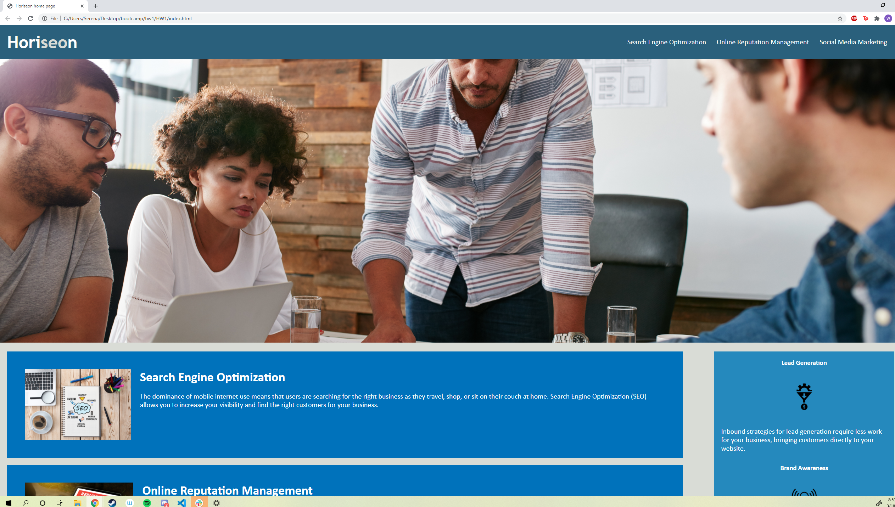

# Homework Assignment 1

## Languages used
- HTML - Used to write out the main code for the website
- CSS - Used to add different effects to the text and images in the HTML

## summary of the assignment
We were given the task of refactoring a website home page. Very few of the changes I made effected the way the page looked, most of the work went into organzing the code, 
and making it easier to read.


## preview image of the website


## Code snippet (example of added alt text)
```html
 
  <article class="content">
    <div id="search-engine-optimization" class="search-engine-optimization">
      
      <h2>Search Engine Optimization</h2>
      <p>
        The dominance of mobile internet use means that users are searching for the right business as they travel, shop,
        or sit on their couch at home. Search Engine Optimization (SEO) allows you to increase your visibility and find
        the right customers for your business.
      </p>
```


## My Links 
[Github](https://github.com/SerenaChandler)